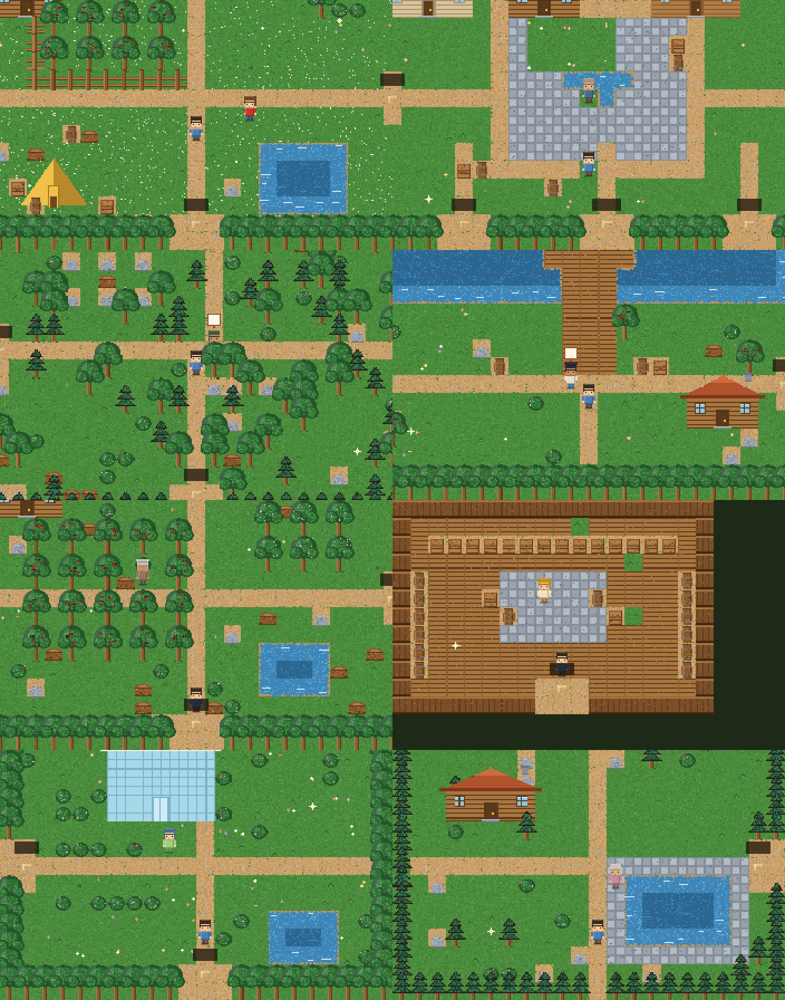

# 🍎 苹果小镇 · Apple Town

一个星露谷风格的像素小镇小游戏：**20 位居民、20 个场景**，
走路、摘苹果、送礼物、跟居民聊天 —— 居民的「脑子」是 **DeepSeek**。

所有像素美术都是**代码画出来的**（没有一张外部图片素材），
整个项目**零第三方依赖**，`node server.js` 就能跑。

> **🌐 在线试玩**：https://samarailly51-pixel.github.io/stardew-town/
> （GitHub Pages 是纯静态托管，默认演示模式 —— 居民用各自的预置台词。
> 想用真模型就在开始界面的输入框里粘一个**你自己的** DeepSeek Key，
> Key 只存在你浏览器里，不会上传到任何服务器。）



---

## 一句话说清它想解决什么

> 20 个 NPC 如果一开局全部「上线」，既费 Token 又费上下文。
>
> 这里的做法是：**你走进哪个场景，才唤醒哪个场景的居民。**
> 右侧面板上能实时看到 `1 / 20` —— 另外 19 位正在睡觉，一次模型请求都不发。

| 省 Token 的三条规则 | 效果 |
|---|---|
| 只有当前场景的居民被实例化 | 同时在线 1/20 |
| 打招呼、问重复的问题走本地台词 / 回复缓存 | 0 成本 |
| 每人只保留最近 3 轮对话 | 上下文不膨胀 |

断网、没填 Key 也能完整演示：每个居民人设里都带 3 句预置台词，
此时面板会标「演示模式」，**不会假装那是模型说的**。

---

## 快速开始

### 方式一：双击启动（Windows，最省事）

1. 双击 **`启动.bat`** —— 自动起服务并打开浏览器
2. 想接真模型：双击 **`填写Key.bat`**，把 DeepSeek Key 粘到 `.env` 里那行等号后面，保存

> 改完 `.env` **不用重启服务**：后端每次请求都会重读配置。
> 不填也能玩，居民会用预置台词回答。

### 方式二：命令行

```bash
cd "D:/PI Agent/stardew-town"
cp .env.example .env      # 然后填入 DEEPSEEK_API_KEY
npm start                 # 打开 http://localhost:3100
```

**不需要 `npm install`** —— 后端零第三方依赖，只用 Node 内置模块。

> ⚠️ 别直接双击 `public/index.html`。`file://` 协议下 ES module 和 `/api/chat` 都用不了，
> 必须通过 `http://localhost:3100` 访问。

---

## 怎么玩

| 操作 | 说明 |
|---|---|
| `W` `A` `S` `D` / `方向键` | 走路（也可以用屏幕左下角的十字键、点地图走路） |
| `空格` / `E` | 摘苹果 · 跟居民说话 · 调查发光的小东西 |
| `M` | 小镇地图（**去过的场景可以一键快速前往**） |
| `Tab` | 农场档案（收成、好感度、模型用量） |
| `Esc` | 关掉对话 / 关掉面板 |

**主玩法：摘苹果。** 走到结果的苹果树下按空格，一棵树摘一次，45 秒后重新结果。

**然后苹果有三个去处：**

1. **送给居民** → 好感度 +8，攒满 25 点变一颗心，3 心之后他会跟你说心里话
2. **卖到小镇广场的收购站** → 4 金币一个
3. **留着**（背包上限就是你的耐心）

**支线：** 每个场景都有 1~2 个会闪光的调查点，调查能翻出一段小镇往事（还送 3 金币）。
场景左上角的进度条是**探索度**。

**换场景不硬切。** 走到路口踩到出口时：

```
踩到出口 → 锁输入 → 黑幕淡入（写着「前往 小镇广场」）
        → 全黑的那一瞬间换场景（加载过程你看不到）
        → 黑幕淡出，你已经站在新场景的门口
        → 这个场景的居民从门口走进来 4 格，你自动跟在后面
        → 交还控制权，飘一条「到达 小镇广场」
```

引路那句话走的是**本地台词**，不花 Token。

---

## 20 个场景 / 20 位居民

拓扑是「双枢纽」结构 —— 广场是商店街的枢纽，农场是野外的枢纽，正常走不会迷路。

```
                          老苹果园 ── 玻璃温室
                              │            │
   后山矿洞 ── 苔藓森林 ── 苹果农场 ── 谷仓牧场
                  │            │
     集市 ── 木工坊            │          小镇广场 ── 面包房 / 铁匠铺 / 图书馆
       │                       │            │          诊所 / 裁缝铺 / 学堂
    山间温泉                 河畔码头       │
       │                    ／      ＼
    山顶天文台        湖畔画室      海角灯塔
```

| 场景 | 居民 | 场景 | 居民 |
|---|---|---|---|
| 苹果农场 | 阿栗 · 果园看树人 | 白芷诊所 | 白芷 · 小镇医生 |
| 小镇广场 | 老橡 · 镇长 | 木工坊 | 木子 · 木匠 |
| 苔藓森林 | 苔藓 · 护林人 | 后山矿洞 | 石头 · 矿工 |
| 河畔码头 | 阿浪 · 渔夫 | 山间温泉 | 汤婆婆 · 老板娘 |
| 麦香面包房 | 麦芽 · 面包师 | 山顶天文台 | 星野 · 观星者 |
| 铁心铁匠铺 | 铁心 · 铁匠 | 集市摊位 | 阿满 · 商人 |
| 小镇图书馆 | 纸鸢 · 图书管理员 | 小镇学堂 | 书声 · 老师 |
| 玻璃温室 | 花铃 · 植物学家 | 针线裁缝铺 | 针线 · 裁缝 |
| 谷仓牧场 | 干草 · 牧场主 | 老苹果园 | 老树 · 老果农 |
| 海角灯塔 | 长明 · 灯塔守 | 湖畔画室 | 颜料 · 湖畔画家 |

> 好感度到 3 心之后，每个人都会说出一件藏在心里的事。
> 那些「心事」写在他们名册的 `lore` 字段里，也是喂给模型的人设的一部分。

---

## 它是怎么搭起来的

```
stardew-town/
├── 启动.bat / 填写Key.bat     一键启动 / 填 Key
├── server.js                  后端：静态托管 + /api/chat 代理 DeepSeek（零依赖）
├── .env.example               Key 模板（.env 已被 .gitignore 屏蔽）
├── public/                    ← 游戏本体
│   ├── index.html             DOM 层：HUD、对话框、手柄、过渡幕
│   ├── styles.css             全部 UI 样式
│   └── js/
│       ├── main.js            主循环：把下面这些接起来
│       ├── core/              输入、相机、确定性随机数
│       ├── art/               ★ 程序化像素美术：调色板 / 瓦片 / 物件建筑 / 角色精灵
│       ├── world/             ★ 20 个场景数据、20 位居民名册、地图构建助手
│       ├── game/              主角、居民实体、交互判定、引路过渡状态机、存档
│       ├── ai/                DeepSeek 客户端 + ★ 按需 Agent 管理器
│       └── ui/                HUD、对话框、地图/档案面板
├── tools/                     ← 测试与渲染工具（见下）
└── screenshots/               render.mjs 生成的真实游戏截图
```

### 程序化像素美术（`public/js/art/`）

项目里**没有任何图片素材**，所有画面都是启动时用 Canvas 一笔一笔画出来再缓存的：

- **瓦片**：草地用「双色抖动」而不是纯色填充；水面的靠岸那几条边会跟着格子哈希抖出起伏的岸线，不然池塘就是个蓝色矩形
- **树木**：树冠是一堆随机圆斑叠出来的，苹果是挂在树冠上的红点
- **建筑**：`makeBuilding(style, w, h)` 参数化生成，换 `style` 就是从木屋变谷仓/温室/帐篷/店铺
- **角色**：每人给一组颜色（发色/上衣/裤子/肤色/发型），生成 4 朝向 × 3 帧（站立 + 左右脚）
- **地面烘焙**：进入场景时把整张地图的地面**一次性烘焙成一张大图**，之后每帧只 `drawImage` 一次；600 格的地图也毫无压力

### 场景切换 + NPC 引路（`public/js/game/transition.js`）

用 `async/await` 写状态机，靠主循环的 `update(dt)` 驱动 `wait()` 推进：

```js
await this.wait(0.42);            // 黑幕淡入
const { guide, gate } = swapScene(portal.to, fromId);   // 在全黑的那一瞬换场景
while (!guide.atTarget) { await this.nextFrame(); /* 玩家跟在 NPC 身后 */ }
```

比一堆 `phase` 变量好读得多，也不会阻塞渲染。

### 按需 Agent（`public/js/ai/agents.js`）

```js
wakeScene(scene)   // 进入场景：只给这个场景的居民建 agent
sleepAll()         // 离开场景：全部销毁，对话历史一并丢掉
reply(id, text)    // 缓存 → 模型；模型不通就退回预置台词，并如实标注来源
```

对话界面里每句话前面都有来源标签：**模型 / 缓存 / 预置台词 / 接口不通·预置台词**。
标出来比藏着好 —— 演示的时候一眼就知道现在到底是不是真模型在说话。

---

## 测试工具（这个项目的另一半）

游戏没法只靠「看起来没报错」交付，所以配了三个脚本：

```bash
npm run check     # 校验 20 个场景的数据完整性
npm run sim       # 端到端仿真：不用浏览器，把整个游戏跑一遍
npm run render    # 把游戏画面真正画出来，导出 PNG 到 screenshots/
```

### `npm run check` — 地图数据校验

手写地图最容易出的错是「传送点通向不存在的场景」「居民被摆在水面上」。
这个脚本在 Node 里给 canvas 打个桩，把 20 个场景全实例化一遍，然后检查：

- 传送点是否**双向对称**（A 通向 B，B 必须也有回 A 的路）
- 出生点、居民站位、传送落点是不是**能站人**
- 从出生点**洪水填充**，看居民和所有传送点是不是真的走得到（有没有被树围死）

```
场景总览
──────────────────────────────────────────────────────────────
id              名称        尺寸    出口  苹果树  物件  居民    可达
apple_farm      苹果农场     26x18   4    12    117  阿栗    100%
town_square     小镇广场     26x18   8    0      65  老橡    100%
...
合计：20 个场景 · 6672 格 · 1440 个立体物件
✅ 全部检查通过
```

### `npm run sim` — 端到端仿真

给 DOM / Canvas / fetch 打桩，把**真的 `main.js`** 跑起来，模拟真人操作：

```
✅ 主循环启动成功
✅ 走路正常：(216,190) → (242,216)
✅ 摘苹果走的是真实交互链路：0 → 1
✅ 20 个场景全部实例化 + 渲染通过
✅ 走了 20 次传送点，全部真实落到目标场景
✅ 20/20 次换场景后，只有本场景的 Agent 被唤醒（其余 19 位在睡觉）
✅ 20/20 次换场景都有 NPC 引路把玩家带进场景
✅ 整个流程 0 次模型请求（演示模式下 Token 消耗为 0）
✅ 对话流程走通 / 送苹果正常 / 调查点生效 / 收购站生效 / 存档写入成功
```

Canvas 桩会**校验每一次绘制调用的参数**（图片是不是画布、坐标是不是有限数），
所以「画的时候炸了」这类问题也能在这里抓到。

> 踩过的坑：浏览器里每个 `requestAnimationFrame` 是**独立任务**，帧与帧之间微任务会被清空。
> 仿真如果一口气同步跑 100 帧，`await` 驱动的引路状态机会永远接不上 ——
> 于是仿真必须每跑一帧就让出一次事件循环。

### `npm run render` — 把画面画出来看

自己实现了一个**光栅化 Canvas**（支持 `fillRect` / `drawImage` / 椭圆 / 多边形填充）
加一个 PNG 编码器，就能在没有浏览器的环境里把游戏画面导出来。
这是唯一能「亲眼确认程序化美术没画歪」的手段 —— 上面那张总览图就是它生成的。

---

## 换成真模型

1. 打开 https://platform.deepseek.com/api_keys 创建 Key（形如 `sk-xxxxxxxx`）
2. 双击 `填写Key.bat`，粘到 `.env` 的 `DEEPSEEK_API_KEY=` 后面，保存
3. 刷新网页 —— 底部标签会从「演示模式」变成「DeepSeek 已接通」

不确定通不通？让服务自己体检：浏览器打开 **http://localhost:3100/api/verify**，
它会真发一次最小请求去问 DeepSeek，然后用人话告诉你结论：

| 返回 | 含义 |
|---|---|
| `"ok": true` | ✅ Key 有效，已接通 |
| `401` | Key 不对（多余空格 / 引号 / 漏了 `sk-`） |
| `402` | Key 是对的，但账户没余额 |
| 超时 | 网络或代理问题 |

**Key 不会进浏览器。** 前端只调 `/api/chat`，Key 只存在于服务端的 `.env` 里。

---

## 想自己改点东西

### 加一个场景

在 `public/js/world/scenes.js` 里照着写一条就行，地图用「底料 + 盖章」的写法，不用担心数错格子：

```js
my_place: {
  id: 'my_place', name: '我的地方', en: 'My Place',
  resident: 'li',                       // 常驻居民（名册里的 id）
  size: [22, 16], fill: '.', border: 'T',
  spawn: { x: 11, y: 13 },
  portals: [{ to: 'apple_farm', side: 'south', at: 11, label: '苹果农场' }],
  buildings: [{ style: 'cabin', x: 3, y: 3, w: 4, h: 3 }],
  build(g, rng) {
    hline(g, 1, 8, 20, '=');                    // 一条路
    grid(g, 4, 4, 3, 3, 2, 2, 'A');             // 一片苹果树
    scatter(g, 'B', 8, rng, ['.']);             // 随机撒灌木
  },
  sparkles: [{ x: 6, y: 12, text: '这里藏着一句你想让玩家发现的话。' }],
},
```

> 别忘了在 `apple_farm` 的 `portals` 里加上回程 —— `npm run check` 会检查双向对称。

### 加一位居民

在 `public/js/world/characters.js` 里加一条，然后跑 `npm run check`：
缺字段、预置台词不足 3 条、配色不全，都会被指出来。

### 地图字符表

```
.  草      ,  草丛    *  花      g  花草地     =  泥路     _  耕地
o  石板    w  木地板  h  墙       ~  浅水       #  深水
T  橡树    P  松树    A  苹果树   K  樱花树     B  灌木
S  树桩    R  石头    F  栅栏     x  木箱       j  木桶     s  木牌
```

---

## 部署到 GitHub Pages（在线试玩）

GitHub Pages 是纯静态托管，**跑不了 Node**，所以项目做了两套运行方式（前面那节讲了）：

| 环境 | 模型怎么走 |
|---|---|
| 本地 / 自己的服务器 | 走 `/api/chat` 代理，Key 只在服务端 |
| **GitHub Pages** | 页面自动切成「**浏览器直连**」：访客自己填 Key（存在他浏览器里） |

```bash
npm run build:pages     # public/ → docs/（Pages 只认仓库根或 /docs）
git add . && git commit -m "deploy" && git push
```

然后在仓库 **Settings → Pages** 里选 `Deploy from a branch` → `main` → `/docs`。

> `docs/` 是构建产物，**故意提交进仓库**（比配 GitHub Actions 简单，也不用担心 Actions 在受限网络下跑不起来）。
> 改了 `public/` 里的东西记得重新 `npm run build:pages`。

### 线上版的 Key 是怎么处理的

- 访客不填：**演示模式**，居民用各自的预置台词，摘苹果/换场景/引路全都正常
- 访客填了：浏览器直接请求 `api.deepseek.com`，Key 只存在他自己的 `localStorage`，**站长的 Key 永远不上网**
- 这个做法可行的原因是 DeepSeek 的 API 开放了 CORS：
  ```
  access-control-allow-origin: <请求方的 Origin>
  access-control-allow-headers: authorization,content-type
  ```
- 如果哪天 CORS 被关了，页面会自动退回预置台词，**不会白屏**

### 如果 `git push` 报连不上 github.com

部分网络下 **`github.com:443` 被阻断**，但 `api.github.com` 和 `github.com:22` 是通的：

```bash
curl -sI -m 8 https://api.github.com    # 200 → 说明只是 github.com 被墙
```

绕行方案是改用 SSH（走 22 端口），并用**仓库级部署密钥**（只给这一个仓库写权限，比个人 SSH key 安全）：

```bash
ssh-keygen -t ed25519 -f ~/.ssh/id_ed25519_apple -N "" -C "apple-town"
gh api -X POST /repos/<你>/stardew-town/keys \
  -f "title=my key" -f "key=$(cat ~/.ssh/id_ed25519_apple.pub)" -F read_only=false
git remote set-url origin git@github.com:<你>/stardew-town.git
git config core.sshCommand "ssh -i ~/.ssh/id_ed25519_apple -o IdentitiesOnly=yes"
git push -u origin main
```

---

## 已知的取舍

- **居民不能同时出现在多个场景**：一人一场景，所以换场景时他会「从门口走进来」而不是本来就在那儿
- **引路只有一条主干道**：引路 NPC 直奔目标格，不做寻路，所以路线是预先选好的短程
- **打字机效果用的是 `setInterval`**，长文本在低端机上偶尔会有一帧顿挫
- **没有战斗、没有天气、没有季节**：这一版的重心是「场景切换 + Agent 按需唤醒」这条链路
- **右上角的地图标签只有文字框**：文字走 DOM 层，canvas 里那层深色底是路牌的底衬

## 可以继续加的东西

- 流式输出（SSE），居民边想边说
- 居民之间互相串门（一场戏里两个 Agent 对话）
- 季节系统：换一套调色板就是秋天/冬天，美术层已经把这部分留好了（`art/palette.js`）
- 把「回复缓存」换成带语义的向量检索，让居民记得住更久以前的事
